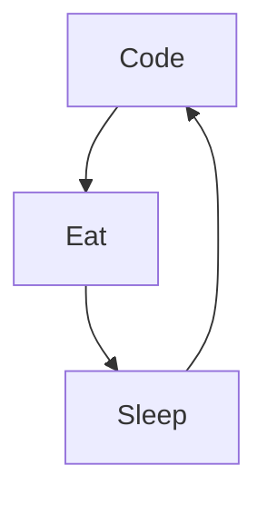

- 👋 Hi, I’m @BigoudOps
- 👀 I’m interested in Linux,Open Source & Podcasting
- 🌱 I’m currently learning python & bash
- 💞️ I’m looking to collaborate on ...
- 📫 How to reach me ? Well check below ...
-  
-  
<!---
BigoudOps/BigoudOps is a ✨ special ✨ repository because its `README.md` (this file) appears on your GitHub profile.
You can click the Preview link to take a look at your changes.
--->

### 🔥 Recent GitHub Activity

<!--START_SECTION:activity-->
1.
2. 
3. 
4.
5.
<!--END_SECTION:activity-->
### 📺 Last Youtube:

<!-- YOUTUBE:START -->
- 
- 
- 
- 
- 
<!-- YOUTUBE:END -->

  
Latest content

<!-- BLOG-POST-LIST:START -->
- 
- 
- 
- 
- 
<!-- BLOG-POST-LIST:END -->
  

