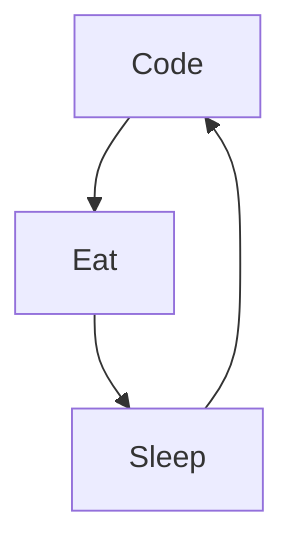

- 👋 Hi, I’m @BigoudOps
- 👀 I’m interested in Linux,Open Source & Podcasting
- 🌱 I’m currently learning python & bash
- 💞️ I’m looking to collaborate on ...
- 📫 How to reach me ? Well check below ...
-  
-  
<!---
BigoudOps/BigoudOps is a ✨ special ✨ repository because its `README.md` (this file) appears on your GitHub profile.
You can click the Preview link to take a look at your changes.
--->

### 🔥 Recent GitHub Activity

<!--START_SECTION:activity-->
1. 🎉 Merged PR [#1](https://github.com/BigoudOps/BigoudOps/pull/1) in [BigoudOps/BigoudOps](https://github.com/BigoudOps/BigoudOps)
2. 💪 Opened PR [#1](https://github.com/BigoudOps/BigoudOps/pull/1) in [BigoudOps/BigoudOps](https://github.com/BigoudOps/BigoudOps)
3. 🎉 Merged PR [#1](https://github.com/BigoudOps/BigoudOps.github.io/pull/1) in [BigoudOps/BigoudOps.github.io](https://github.com/BigoudOps/BigoudOps.github.io)
4. 💪 Opened PR [#1](https://github.com/BigoudOps/BigoudOps.github.io/pull/1) in [BigoudOps/BigoudOps.github.io](https://github.com/BigoudOps/BigoudOps.github.io)
5.
<!--END_SECTION:activity-->
### 📺 Last Youtube:

<!-- YOUTUBE:START -->
- [dernier épisode sur ce flux- John ManchotCast &lpar;made with Spreaker&rpar;](https://www.youtube.com/watch?v=J73IX1faNfA)
- [eggs huawei android 8](https://www.youtube.com/watch?v=SC5zfie0hd0)
- [Episode 39 - John ManchotCast la suite du Dev &lpar;made with Spreaker&rpar;](https://www.youtube.com/watch?v=X6nS3IbHg8w)
- [Episode 38 - John ManchotCast et la programmation html5 css3 &lpar;made with Spreaker&rpar;](https://www.youtube.com/watch?v=zpNfZxyzIiI)
- [Episode 37 - John ManchotCast et le jus est revenu &lpar;made with Spreaker&rpar;](https://www.youtube.com/watch?v=TBpIZKNmpEc)
<!-- YOUTUBE:END -->

  
Latest content

<!-- BLOG-POST-LIST:START -->
- [Nouvelle année nouveaux projets](https://bigoudops.fr/nouvelle-annee-nouveaux-projets/)
- [Bientôt 5 ans de Podcasts](https://bigoudops.fr/bientot-5-ans-de-podcasts/)
- [Personnaliser un thème complet pour Ventoy](https://bigoudops.fr/personnaliser-un-theme-complet-pour-ventoy/)
- [help me , ma souris ne clique plus](https://bigoudops.fr/help-me-ma-souris-ne-clique-plus/)
- [Contribuer facilement à OpenStreetMap](https://bigoudops.fr/contribuer-facilement-a-openstreetmap/)
<!-- BLOG-POST-LIST:END -->
  

